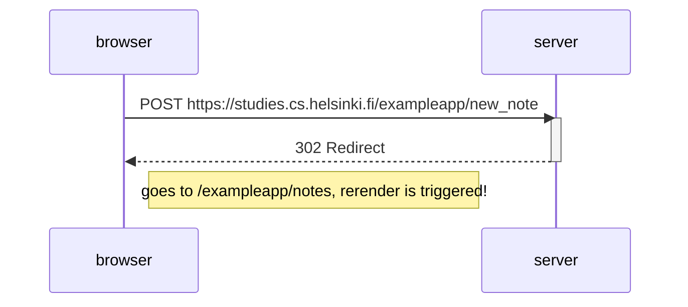

# Diagram for exercise 0.4

```mermaid
sequenceDiagram
    participant browser
    participant server

    browser->>server: POST https://studies.cs.helsinki.fi/exampleapp/new_note
    activate server
    server-->>browser: 302 Redirect
    deactivate server

    Note right of browser: goes to /exampleapp/notes, rerender is triggered!
```
