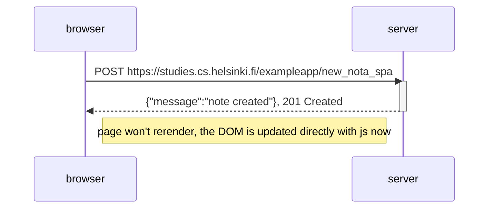

# Diagram for exercise 0.6

```mermaid
sequenceDiagram
    participant browser
    participant server

    browser->>server: POST https://studies.cs.helsinki.fi/exampleapp/new_nota_spa
    activate server
    server-->>browser: {"message":"note created"}, 201 Created
    deactivate server

    Note right of browser: page won't rerender, the DOM is updated directly with js now
```
